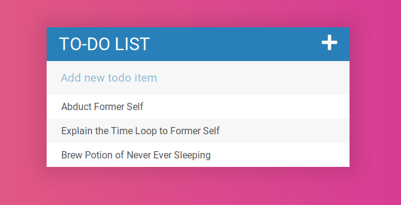

# Simple jQuery To-Do

A simple to-do prototype 'app' (in the loosest sense of the word, that is) written in jQuery and Sass.

Press the plus icon to show and hide the row to add a to-do item. Click an item on the list to cross it off; click the 'trash' button to delete it completely.

This won't save your todos across page refresh.

Made as part of the [Web Developer Bootcamp on Udemy](https://www.udemy.com/the-web-developer-bootcamp/learn/v4/overview).
